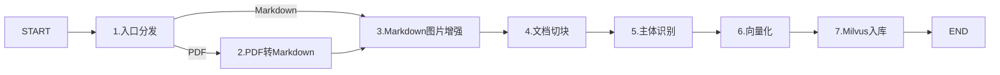
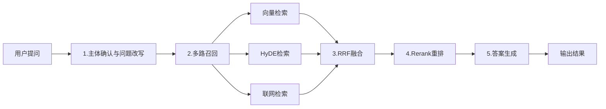

# AGENTS.md

## Project Overview

这是一个基于python的RAG知识库项目。

主要功能:
- 文件上传(pdf, md)
- 文档解析
- 文档切分
- Embedding
- 向量检索
- RRF
- Rerank
- LLM问答

## Tech Stack

- python 3.11
- FastAPI
- LangGraph
- LangChain
- MinerU
- Milvus
- MinIO
- MongoDB
- BGE-M3
- Reranker

## Project Structure

```text
├── AGENTS.md
├── app                 # 项目主要入口
│  ├── api              # web_API
│  ├── infra            # 提供.env中变量的加载类
│  ├── process          # 业务逻辑, langgraph节点和图定义
│  ├── rag              # 业务逻辑, langgraph节点具体实现
│  ├── rag_eval         # 评估代码 （无用）
│  ├── resources        # 静态资源（提示词）
│  └── shared           # 共享资源（包含logger工具、模型配置等）
├── doc                 # 存放原始文档
├── logs                # 日志
├── output              # 存放MinerU处理后的文档
├── pyproject.toml      
├── test                # 测试
└── uv.lock
```

## Development Rules

- 使用Python 3.11，不准更改版本。
- 定义函数需要使用类型注解，声明输入值类型和输出类型。
- 新增函数需要添加符合google标准的docstring。
- 不要修改已有API。
- 修改代码时尽量保持现有项目结构。
- 不要为了修复一个问题大范围重构代码，尽量小范围修改。
- 做任何任务之前都要先给方案，等待方案确认后再进行修改。

## Running

启动import_server
```python
python -m app.api.server.import_server
```

启动query_server
```python
python -m app.api.server.query_server
```

## Infrastructure

项目依赖以下Docker服务：
- MinIO
- Milvus
- MongoDB

docker compose配置位于
```text
~/docker
```

## RAG Pipeline

导入流程为：


查询流程为: 


## State Rules

State使用TypedDict定义。请勿随意修改已有字段或添加字段。

## Codding Style

- 使用python类型注解。
    推荐：
    ```python
    def search(
        query: str,
        top_k: int = 10,
    ) -> list[dict]:
        ...
    ```

- 进行路径操作时，优先使用 `Path` 包而不是 `os.path`。
- 对于可能出现的异常需要进行一场捕获，需要保留错误信息：
    ```python
    try:
        ...
    except Exception as e:
        logger.exception("Failed to process document: %s", e)
        raise
    ```

## Modification Rules

修改代码时：
1. 先阅读相关文件。
2. 理解调用关系。
3. 找到真正的问题。
4. 尽量进行最小修改。
5. 修改后运行相关测试。
禁止：
- 无理由重构整个模块
- 删除已有功能
- 修改无关文件
- 修改 API 接口而不说明原因
- 为了通过测试硬编码结果

## Dependencies

添加依赖之前：
1. 检查 pyproject.toml
2. 检查当前是否已经存在类似依赖
3. 优先使用已有依赖
4. 不要重复安装功能相同的库